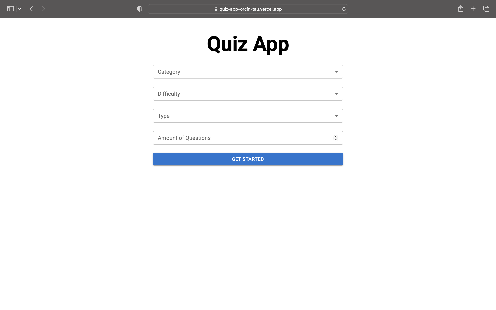

# QUIZ APP


## Introduction
I love quizzes so figured i would create a simple quiz game that can be played by anyone and allows them to set their own difficulty and choose their own category which are generated trivia
## Installation
* This is how to install react on local machine 
* I used the first command becuase I had already cloned my github folder so the react would be created in quiz-app directory/repository. Since Im using yarn so Ill use the first command:
```
1. yarn create react-app ./
2. yarn create react-app my-app
OR
1. npx create react-app ./
2. npx create react-app my-app
```
* This is how you install react-router-dom. Since Im using yarn so Ill use the first command:
```
yarn add react-router-dom
OR
npm install react-router-dom
```
* This is how to install material ui. Since Im using yarn so Ill use the first command:
```
yarn add @mui/material @emotion/react @emotion/styled
OR
npm install @mui/material @emotion/react @emotion/styled
```
* Also took the google web fonts which can be found public folder/ directory in the index.html file placed the following underneath ```<link rel="manifest" href="%PUBLIC_URL%/manifest.json" />``` use this for the font family:
```
<link
  rel="stylesheet"
  href="https://fonts.googleapis.com/css?family=Roboto:300,400,500,700&display=swap"
/>
```
* Need to install axios for the [trivia](https://opentdb.com/api_config.php) api that will generate the trivia/qiz question for this application. Since Im using yarn so Ill use the first command:
```
yarn add axios
OR
npm install axios
```
* Need to install React Redux for the settings to be linked to the questions page when user has setup the quiz / trivia on the setting / homepage use this command in your terminal. Since Im using yarn so Ill use the first command:
```
yarn add redux react-redux
OR
npm install redux react-redux
```
* In order to remove the special characters from the question for example ```Who voices Max Payne in the 2001 game &quot;Max Payne&quot;?``` the characters im referring to are the "&uot;Max Payne&quot;" we need to install html-entites to get rid of those characters/words so actual question is clear for the users of the trivia/quiz app. Since Im using yarn so Ill use the first command:
```
yarn add html-entities
OR
npm install html-entities
```
* The trivia api used to for the quiz application comes from this site
```
https://opentdb.com/api_config.php
```
## Contributing
Anyone is welcome to contribute to this project. Cant wait to see where you take it in near future
## Related Projects
## Licensing
## Deployment Tools
[Vercel](https://vercel.com) is the deployment tool used for this application. Great platform for hobby projects and you only pay when you are buying a domain name other vercel generates a domain name for you.
---
# Getting Started with Create React App

This project was bootstrapped with [Create React App](https://github.com/facebook/create-react-app).

## Available Scripts

In the project directory, you can run:

### `yarn start`

Runs the app in the development mode.\
Open [http://localhost:3000](http://localhost:3000) to view it in your browser.

The page will reload when you make changes.\
You may also see any lint errors in the console.

### `yarn test`

Launches the test runner in the interactive watch mode.\
See the section about [running tests](https://facebook.github.io/create-react-app/docs/running-tests) for more information.

### `yarn build`

Builds the app for production to the `build` folder.\
It correctly bundles React in production mode and optimizes the build for the best performance.

The build is minified and the filenames include the hashes.\
Your app is ready to be deployed!

See the section about [deployment](https://facebook.github.io/create-react-app/docs/deployment) for more information.

### `yarn eject`

**Note: this is a one-way operation. Once you `eject`, you can't go back!**

If you aren't satisfied with the build tool and configuration choices, you can `eject` at any time. This command will remove the single build dependency from your project.

Instead, it will copy all the configuration files and the transitive dependencies (webpack, Babel, ESLint, etc) right into your project so you have full control over them. All of the commands except `eject` will still work, but they will point to the copied scripts so you can tweak them. At this point you're on your own.

You don't have to ever use `eject`. The curated feature set is suitable for small and middle deployments, and you shouldn't feel obligated to use this feature. However we understand that this tool wouldn't be useful if you couldn't customize it when you are ready for it.

## Learn More

You can learn more in the [Create React App documentation](https://facebook.github.io/create-react-app/docs/getting-started).

To learn React, check out the [React documentation](https://reactjs.org/).

### Code Splitting

This section has moved here: [https://facebook.github.io/create-react-app/docs/code-splitting](https://facebook.github.io/create-react-app/docs/code-splitting)

### Analyzing the Bundle Size

This section has moved here: [https://facebook.github.io/create-react-app/docs/analyzing-the-bundle-size](https://facebook.github.io/create-react-app/docs/analyzing-the-bundle-size)

### Making a Progressive Web App

This section has moved here: [https://facebook.github.io/create-react-app/docs/making-a-progressive-web-app](https://facebook.github.io/create-react-app/docs/making-a-progressive-web-app)

### Advanced Configuration

This section has moved here: [https://facebook.github.io/create-react-app/docs/advanced-configuration](https://facebook.github.io/create-react-app/docs/advanced-configuration)

### Deployment

This section has moved here: [https://facebook.github.io/create-react-app/docs/deployment](https://facebook.github.io/create-react-app/docs/deployment)

### `yarn build` fails to minify

This section has moved here: [https://facebook.github.io/create-react-app/docs/troubleshooting#npm-run-build-fails-to-minify](https://facebook.github.io/create-react-app/docs/troubleshooting#npm-run-build-fails-to-minify)
